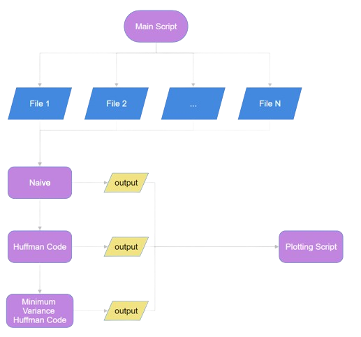

# Introduction

This work evaluates the performance of the Standard Huffman Coding Algorithm and the Minimum
Variance Huffman Coding Algorithm in the context
of DNA-based data storage. With the increasing data
generation and the need for efficient storage solutions to cope with this demand, DNA storage showed
promising capabilities due to its high-density storage
capacity. This work explores and compares two
algorithms to determine their efficiency in reducing
the length of the encoded DNA holding data and optimizing its storage in DNA molecules. The comparison
involves analyzing information density and compression ratio. Results highlight the strengths and limitations of the tested techniques, providing insights into
their applicability on a large scale.

